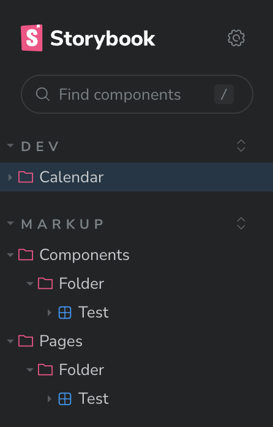

# Getting Started

## 프로젝트 환경

- next.js 14.0.1
- [Pages Router 기반](https://nextjs.org/docs/getting-started/installation)

## Step 0: Install

해당 레포는 pnpm을 사용하고 있습니다.
pnpm을 사용하여 install 해주세요.

```bash
pnpm i
```

## Step 2: Move to `/web`

web project는 root 내부의 `/web` folder에 mono repo로 설정되어 있습니다.
storybook 와 web 구동은 `/web` 폴더로 이동하여 해주세요.

```bash
# at root folder
cd ./web
```

### Storybook 구동

```bash
pnpm storybook
```

### 웹 구동

```bash
pnpm dev
```

# 컨벤션

마크업 & 개발 협업을 위해서 아래와 같이 개발 부탁드립니다.

## 폴더 구조

```
├── markup
│   ├── components // 마크업 컴포넌트
│   └── pages // 마크업 페이지
├── components // 개발 컴포넌트
├── pages // 개발 페이지 - page router 기반
├── stories
│   ├── Markup // 마크업 storybook
│   └── Dev // 개발 storybook
```

## Storybook 구조



아래와 같이 title을 수정하여 위와 같은 경로로 설정합니다.

### dev storybook title

```
title: 'Dev/{FolderName}/{ComponentName}'
```

### markup storybook title

components

```
title: 'Markup/Components/{FolderName}/{ComponentName}'
```

pages

```
title: 'Markup/Pages/{FolderName}/{PageName}'
```

# 단축키 - 코드 생성

vscode 사용시에 snippet을 활용하여 쉽게 파일 초기 템플릿 코드를 불러올 수 있습니다.

## MarkUp

### create markup component

- 위치: `web/src/markup/components/**`
- 방법: 파일 생성 > `rcm` + [TAB]

<details>
<summary>코드</summary>

<!-- summary 아래 한칸 공백 두어야함 -->

```ts
import React from 'react';

interface TestViewProps {}

const TestView = ({}: TestViewProps) => {
  return <></>; // 코드를 작성해주세요
};

export default TestView;
```

</details>

### create markup page

- 위치: `web/src/markup/pages/**`
- 방법: 파일 생성 > `rpm` + [TAB]

<details>
<summary>코드</summary>

<!-- summary 아래 한칸 공백 두어야함 -->

```ts
import React from 'react';

interface TestPageViewProps {}

const TestPageView = ({}: TestPageViewProps) => {
  return <></>; // 코드를 작성해주세요
};

export default TestPageView;
```

</details>

### create storybook markup page

- 위치: `web/src/stories/Markup/pages/**/**`
- 방법: 파일 생성 > `smp` + [TAB]

<details>
<summary>코드</summary>

<!-- summary 아래 한칸 공백 두어야함 -->

```ts
import type {Meta, StoryObj} from '@storybook/react';

import Test from 'markup/pages/Test';

// More on how to set up stories at: https://storybook.js.org/docs/writing-stories#default-export
const meta = {
  title: 'Markup/Pages/folder/Test',
  component: Test,
  parameters: {
    // Optional parameter to center the component in the Canvas. More info: https://storybook.js.org/docs/configure/story-layout
    layout: 'centered',
  },
  // This component will have an automatically generated Autodocs entry: https://storybook.js.org/docs/writing-docs/autodocs
  tags: ['autodocs'],
  // More on argTypes: https://storybook.js.org/docs/api/argtypes
  argTypes: {},
} satisfies Meta<typeof Test>;

export default meta;
type Story = StoryObj<typeof meta>;

// More on writing stories with args: https://storybook.js.org/docs/writing-stories/args
export const Primary: Story = {
  args: {},
};
```

</details>

### create storybook markup component

- 위치: `web/src/stories/Markup/components/**/**`
- 방법: 파일 생성 > `smc` + [TAB]

<details>
<summary>코드</summary>

<!-- summary 아래 한칸 공백 두어야함 -->

```ts
import type {Meta, StoryObj} from '@storybook/react';

import Test from 'markup/components/Test';

// More on how to set up stories at: https://storybook.js.org/docs/writing-stories#default-export
const meta = {
  title: 'Markup/Components/folder/Test',
  component: Test,
  parameters: {
    // Optional parameter to center the component in the Canvas. More info: https://storybook.js.org/docs/configure/story-layout
    layout: 'centered',
  },
  // This component will have an automatically generated Autodocs entry: https://storybook.js.org/docs/writing-docs/autodocs
  tags: ['autodocs'],
  // More on argTypes: https://storybook.js.org/docs/api/argtypes
  argTypes: {},
} satisfies Meta<typeof Test>;

export default meta;
type Story = StoryObj<typeof meta>;

// More on writing stories with args: https://storybook.js.org/docs/writing-stories/args
export const Primary: Story = {
  args: {},
};
```

</details>

## Dev

### create component

- 위치: `web/src/components/**`
- 방법: 파일 생성 > `rcf` + [TAB]

### create page

- 위치: `web/src/pages/**`
- 방법: 파일 생성 > `rpf` + [TAB]

### create storybook dev component

- 위치: `web/src/stories/Dev/**/**`
- 방법: 파일 생성 > `rcm` + [TAB]

<details>
<summary>코드</summary>

<!-- summary 아래 한칸 공백 두어야함 -->

```ts
import type {Meta, StoryObj} from '@storybook/react';

import Test from 'components/Calendar/Test';

// More on how to set up stories at: https://storybook.js.org/docs/writing-stories#default-export
const meta = {
  title: 'Dev/Calendar/Test',
  component: Test,
  parameters: {
    // Optional parameter to center the component in the Canvas. More info: https://storybook.js.org/docs/configure/story-layout
    layout: 'centered',
  },
  // This component will have an automatically generated Autodocs entry: https://storybook.js.org/docs/writing-docs/autodocs
  tags: ['autodocs'],
  // More on argTypes: https://storybook.js.org/docs/api/argtypes
  argTypes: {},
} satisfies Meta<typeof Test>;

export default meta;
type Story = StoryObj<typeof meta>;

// More on writing stories with args: https://storybook.js.org/docs/writing-stories/args
export const Primary: Story = {
  args: {
    date: 1,
    score: 0,
    successGoalCount: 0,
  },
};
```

# Next.js

This is a [Next.js](https://nextjs.org/) project bootstrapped with [`create-next-app`](https://github.com/vercel/next.js/tree/canary/packages/create-next-app).

## Getting Started

First, run the development server:

```bash
npm run dev
# or
yarn dev
# or
pnpm dev
# or
bun dev
```

Open [http://localhost:3000](http://localhost:3000) with your browser to see the result.

You can start editing the page by modifying `pages/index.tsx`. The page auto-updates as you edit the file.

[API routes](https://nextjs.org/docs/api-routes/introduction) can be accessed on [http://localhost:3000/api/hello](http://localhost:3000/api/hello). This endpoint can be edited in `pages/api/hello.ts`.

The `pages/api` directory is mapped to `/api/*`. Files in this directory are treated as [API routes](https://nextjs.org/docs/api-routes/introduction) instead of React pages.

This project uses [`next/font`](https://nextjs.org/docs/basic-features/font-optimization) to automatically optimize and load Inter, a custom Google Font.

## Learn More

To learn more about Next.js, take a look at the following resources:

- [Next.js Documentation](https://nextjs.org/docs) - learn about Next.js features and API.
- [Learn Next.js](https://nextjs.org/learn) - an interactive Next.js tutorial.

You can check out [the Next.js GitHub repository](https://github.com/vercel/next.js/) - your feedback and contributions are welcome!

## Deploy on Vercel

The easiest way to deploy your Next.js app is to use the [Vercel Platform](https://vercel.com/new?utm_medium=default-template&filter=next.js&utm_source=create-next-app&utm_campaign=create-next-app-readme) from the creators of Next.js.

Check out our [Next.js deployment documentation](https://nextjs.org/docs/deployment) for more details.
